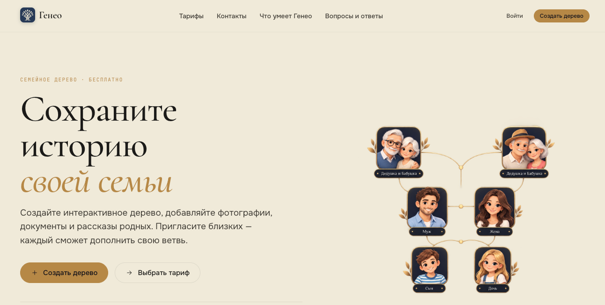
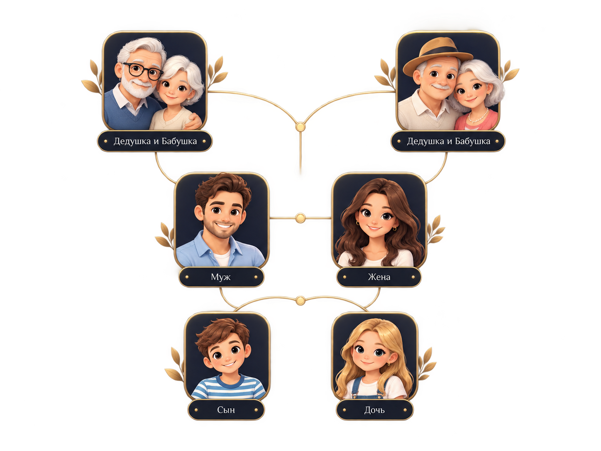
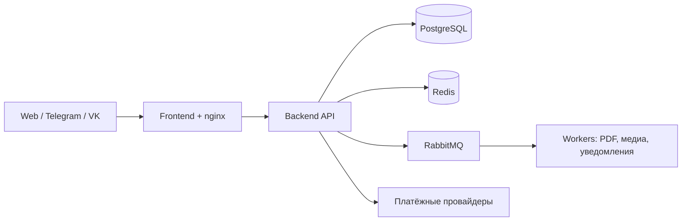

# Генео — showcase

> Платформа семейных деревьев: сохранение семейной истории, совместная работа и публикация по ссылке.

**Сайт:** [генео.рф](https://генео.рф) · **Признание:** лауреат ТОП-100 УРФО.

## Возможности

- интерактивное семейное дерево в графовом и иерархическом режимах;
- публичные ссылки и гибкие права доступа;
- импорт и экспорт GEDCOM, PNG и PDF;
- профили людей, медиа и документы;
- семейная PDF-книга, платежи и подписки;
- вход и коммуникации через Telegram и VK.

## Интерфейс



*Главная страница сервиса семейных деревьев.*

## Иллюстрация дерева



*Обезличенная иллюстрация интерфейса: в ней нет пользовательских профилей или реальных семейных данных.*

## Архитектура



## Инженерные акценты

`TypeScript` · `NestJS` · `PostgreSQL` · `Redis` · `RabbitMQ` · `Docker` · `Kubernetes` · `GitLab CI`

## Обезличенный пример политики доступа

```ts
type TreeRole = 'owner' | 'editor' | 'viewer';

function canPublish(role: TreeRole) {
  return role === 'owner';
}
```

*Это схематичный публичный пример; реальные правила, данные и endpoints не раскрываются.*

Платформа рассчитана на приватность семейных данных: публичная витрина не содержит исходный production-код, базы данных, секреты, внутренние endpoints или данные пользователей.
